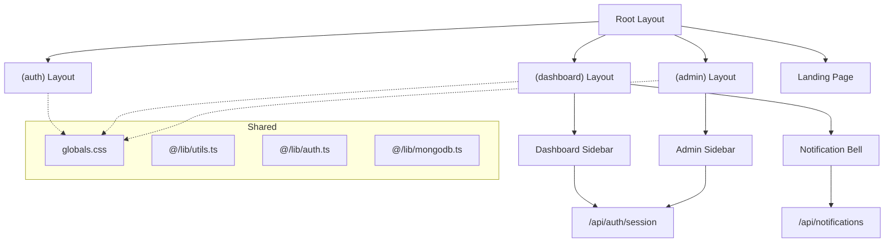

# MEMORY.MD — Application State & Context

> **Living document** — tracks all views, data dependencies, current sprint state, and pending modifications.

---

## 📋 Complete View/Route Inventory

### 🌐 RUNE Core (Express + Vanilla HTML)
| Route | File | Type | Description |
|-------|------|------|-------------|
| `/` | `public/index.html` | User | Single-page app with tab switcher |
| Tab: Profile Stalk | `public/index.html#tabContentProfile` | User | TikTok profile lookup form + result card |
| Tab: Video Info | `public/index.html#tabContentVideo` | User | TikTok video URL lookup + result card |
| `GET /api/tiktok/stalk/:username` | `server.js` | API | Scrape TikTok profile data |
| `POST /api/tiktok/video` | `server.js` | API | Scrape TikTok video data |
| `GET /api/proxy-image` | `server.js` | API | CORS proxy for TikTok images |

### 🔐 RuneClipy — Auth Views `(auth)` Route Group
| Route | File | Type | Description |
|-------|------|------|-------------|
| `/login` | `(auth)/login/page.tsx` | Auth | Login form |
| `/register` | `(auth)/register/page.tsx` | Auth | Registration form |
| `/forgot-password` | `(auth)/forgot-password/page.tsx` | Auth | Password recovery |

### 👤 RuneClipy — User Dashboard `(dashboard)` Route Group
| Route | File | Type | Description |
|-------|------|------|-------------|
| `/dashboard` | `(dashboard)/dashboard/page.tsx` | User | Campaign listing (browse & join) |
| `/campaigns` | `(dashboard)/campaigns/page.tsx` | User | My submitted videos |
| `/analytics` | `(dashboard)/analytics/page.tsx` | User | Personal analytics dashboard |
| `/leaderboard` | `(dashboard)/leaderboard/page.tsx` | User | Global creator leaderboard |
| `/accounts` | `(dashboard)/accounts/page.tsx` | User | TikTok account linking/verification |
| `/balance` | `(dashboard)/balance/page.tsx` | User | Balance display + withdrawal requests |
| `/profile` | `(dashboard)/profile/page.tsx` | User | User profile + settings + Discord bind |

### 🛡️ RuneClipy — Admin Panel `(admin)` Route Group
| Route | File | Type | Description |
|-------|------|------|-------------|
| `/admin` | `(admin)/admin/page.tsx` | Admin | Dashboard overview (stats + charts + tables) |
| `/admin/campaigns` | `(admin)/admin/campaigns/page.tsx` | Admin | Campaign list + management |
| `/admin/campaigns/new` | `(admin)/admin/campaigns/new/page.tsx` | Admin | Create new campaign form |
| `/admin/campaigns/[id]` | `(admin)/admin/campaigns/[id]/page.tsx` | Admin | Edit campaign detail |
| `/admin/submissions` | `(admin)/admin/submissions/page.tsx` | Admin | Review pending submissions |
| `/admin/users` | `(admin)/admin/users/page.tsx` | Admin | User management (ban, tier, role) |
| `/admin/accounts` | `(admin)/admin/accounts/page.tsx` | Admin | Verified accounts overview |
| `/admin/payouts` | `(admin)/admin/payouts/page.tsx` | Admin | Process withdrawal requests |
| `/admin/finance` | `(admin)/admin/finance/page.tsx` | Admin | Financial reporting |
| `/admin/activity-log` | `(admin)/admin/activity-log/page.tsx` | Admin | Audit trail viewer |
| `/admin/discord` | `(admin)/admin/discord/page.tsx` | Admin | Discord bot control panel |
| `/admin/settings` | `(admin)/admin/settings/page.tsx` | Admin | Platform-wide settings |

### 📄 RuneClipy — Public/Shared Pages
| Route | File | Type | Description |
|-------|------|------|-------------|
| `/` | `page.tsx` | Public | Landing page (SSR with real stats, 3D hero) |
| `/campaign/[id]` | `campaign/[id]/page.tsx` | Public | Campaign detail page |
| `/creator/[username]` | `creator/[username]/page.tsx` | Public | Public creator profile |
| `/creator-terms` | `creator-terms/page.tsx` | Legal | Creator Terms of Use |
| `/privacy-policy` | `privacy-policy/page.tsx` | Legal | Privacy Policy |

---

## 🗄️ Data Dependencies

### Mongoose Models (10 Models — `src/models/`)
| Model | Key Fields | Used By |
|-------|-----------|---------|
| `User` | username, email, role, tier, badges[], stats{}, paymentMethods[], isBanned, discordId | Auth, Dashboard, Admin, Bot |
| `Campaign` | title, slug, status, type, totalBudget, budgetUsed, ratePerMillionViews, earningType, sounds[], leaderboardBonuses[] | Dashboard, Admin, Bot, Landing |
| `Submission` | campaignId, userId, videoUrl, views, earned, status, reviewedBy | Campaigns, Admin, Bot |
| `Transaction` | userId, type, amount, status, method, reference | Balance, Admin Finance |
| `ConnectedAccount` | userId, tiktokUsername, isVerified | Accounts, Admin, Bot |
| `Notification` | userId, type, title, message, icon, link, isRead | Dashboard layout (bell) |
| `ActivityLog` | actor, action, target, targetType, details | Admin Activity Log |
| `BotStatus` | command, status, error, username, guildCount, ping, lastHeartbeat | Admin Discord, Bot |
| `SiteSetting` | discordGuildId, discordNotifChannelId | Admin Settings, Bot |
| `Referral` | referrerId, referredId, status | Profile, Admin |

### Global State Management
- **No Redux/Zustand** — uses React `useState`/`useEffect` with API fetching per page
- **Session**: `iron-session` (cookie-based, stateless) via `getSession()` from `@/lib/auth`
- **Notification polling**: Dashboard layout polls `/api/notifications` every 30s
- **Bot polling**: Bot polls MongoDB `BotStatus` collection every 5s

### External Services
| Service | Purpose | Config |
|---------|---------|--------|
| MongoDB Atlas | Database | `MONGODB_URI` env |
| Vercel | RuneClipy hosting | Connected to GitHub |
| Railway | Discord bot hosting | Standalone service |
| Nodemailer | Email (OTP, welcome, etc.) | SMTP env vars |
| Discord API | Bot + webhooks | Bot token + guild ID |

---

## 🎯 Current Sprint State

### Sprint: UI/UX Redesign Phase 2 — RUNE Core Complete
**Status**: ✅ Phase 2 Complete (2026-05-19)

### Immediate UI Modification Goals
1. ~~**Phase 1**: Discovery & audit~~ ✅ Complete
2. ~~**Phase 2**: RUNE Core frontend redesign~~ ✅ Complete — SVG icons, canvas particles, expanded 960px layout, holographic cards, premium glassmorphism
3. **Phase 3**: RuneClipy Landing Page polish ← NEXT
4. **Phase 4**: RuneClipy Dashboard (User) redesign
5. **Phase 5**: RuneClipy Admin Panel redesign
6. **Phase 6**: Auth pages refinement
7. **Phase 7**: Responsive/Mobile perfection pass

### Known Pending Issues
- [ ] Admin table headers are not sticky
- [ ] No filter drawer implementation in admin views
- [ ] Missing batch action UI for submissions/users
- [ ] Landing page footer has dead links (/support, /contact)
- [ ] Admin dashboard charts are basic bar charts, could use Recharts instead of custom CSS
- [ ] No dark/light mode toggle (dark-only currently — intentional)
- [ ] 3D Hero scene may cause performance issues on mobile

---

## 🔗 Cross-Component Dependencies

---

*Last updated: 2026-05-19*
